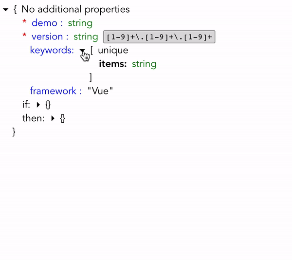

# json-schema-vuer

## Add to project
```
npm install json-schema-vuer
```

## Description
Vue component to visualize JSON schema in interactive view. Based on official JSON schema documentation: https://json-schema.org

## Project Dependencies
vue

## Example
```html
<JsonSchemaViewer schema='{"type":"object","properties":{"demo":{"type":"string"},"version":{"type":"string","pattern":"[1-9]+\\.[1-9]+\\.[1-9]+"},"keywords":{"type":"array","items":{"type":"string"},"uniqueItems":true},"framework":{"const":"Vue"}},"if":{"properties":{"keywords":{"items":{"const":"Json Schema"},"additionalItems":true}}},"then":{"required":["jsonSchemaVersion"],"properties":{"jsonSchemaVersion":{"type":"integer","exclusiveMinimum":0,"maximum":7}}},"additionalProperties":false,"required":["demo","version"]}'/>
```


